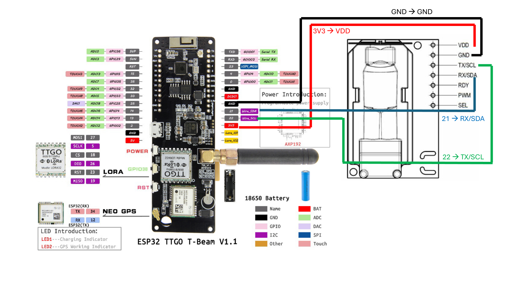

# Exercise week 03
## Hello Sensors! - Simple sensor programs

### Goal for the day

  * Familiarize yourself with the connections of a LilyGo-board
  * Connect a CO2-sensor to the board
  * Read and understand the output of the sensor

### Connecting and reading an external Sensor

**Note before we start:** Remember when working with physical computing, there is always a risk of things going wrong and breaking, different from software.
Therefore, double-check you use the correct pins and make sure that your cables are away from the battery before even starting the device - just to be on the sure side ;)

#### Connecting the external sensor

Before we start writing code, let's connect the sensor to our board.

We use the Sensiron SCD30 sensor.
[Here](https://github.com/Sensirion/arduino-i2c-scd30/blob/master/pinouts/esp32-devkitc.md) you can find a pinout for the SCD30 sensor, and [here](https://github.com/Xinyuan-LilyGO/LilyGo-LoRa-Series/blob/master/assets/image/t-beam_v1.1_pinmap.jpg) you can find a pinmap for our board (TTGO T-Beam V1.1). Connect the pins from the board to the sensor via the breadboard using the handed-out jumper cables.
If you are unsure how a breadboard works, [this article](https://wiring.org.co/learning/tutorials/breadboard/) explains it pretty well. Below how to connect the sensors are expanded on:

Using the jumper cables & the breadboard, you should connect the pins on your board and the pins on the SCD30 as follow:

| T-Beam                | SCD30 |
|-----------------------|-------|
|3V3                    |VIN/VDD|
|GND                    |GND    |
|21                     |RX/SDA |
|22                    |TX/SCL |

Using these resources, we can conclude that our setup should look something like this:



**Source of pinmaps:** https://blog.fh-kaernten.at/ingmarsretro/files/2021/04/anschluss-rotated.jpg && https://github.com/Xinyuan-LilyGO/LilyGo-LoRa-Series/blob/master/assets/image/t-beam_v1.1_pinmap.jpg?raw=true

Now we are ready to turn on the device and write some code!

#### Reading/programming the external sensor

To be able to communicate with the sensor, we need some sort of I2C bus. Curious about the I2C bus? [Here](https://learn.sparkfun.com/tutorials/i2c/all) you can find more information about it! :D
Also, here is a simple [I2C scanner](https://github.com/ITU-DASYALab/IoT_course/blob/main/guides/I2C_scanner.md) to show you what I2C devices there are connected on your board.

The simplest way to get an I2C bus for our specific sensor is to download it using the library manager in the Arduino IDE.
Search for "Sensirion I2C SCD30", and when asked for download dependencies, answer yes.
With both your board connected to the sensor, as well as the I2C library downloaded, you are ready to read some temperatures.

**The challenge for you:** Try writing a simple program reading what your sensor senses. You should be able to read the CO2 concentration, temperature, and humidity, and then print them in the serial monitor. Good luck! :D 

**Tip!** The library has an example of how to use the sensor. You will find it under ... Examples :), in your Arduino IDE menu. This is a good starting point for understanding how to write your program.

Once you got it running, let us talk about what we are seeing and how to interprete it.

And about what might be happening here:

```
10:33:25.291 -> co2: 568.81	temperature: 23.00	humidity: 31.32
10:33:35.322 -> co2: 570.12	temperature: 23.03	humidity: 31.17
10:33:45.319 -> co2: 2842.36	temperature: 24.12	humidity: 68.11
10:33:55.350 -> co2: 9174.95	temperature: 24.64	humidity: 65.74
10:34:05.380 -> co2: 6610.78	temperature: 24.60	humidity: 48.32
```


---

### Acknowledgements

The exercise is inspired by some of the previous TA's nice exercises from previous years:

https://github.com/FlapKap/IoT-CO2-sensor-exercise?tab=readme-ov-file

https://github.com/ITU-DASYALab/IoT_course/blob/main/exercises/archive_2022/exercise-03-sensors.md


**All links used in the exercise**

https://github.com/Sensirion/arduino-i2c-scd30

https://github.com/Sensirion/arduino-i2c-scd30/blob/master/pinouts/esp32-devkitc.md

https://github.com/Xinyuan-LilyGO/LilyGo-LoRa-Series/blob/master/assets/image/t-beam_v1.1_pinmap.jpg

https://wiring.org.co/learning/tutorials/breadboard/

https://learn.sparkfun.com/tutorials/i2c/all
