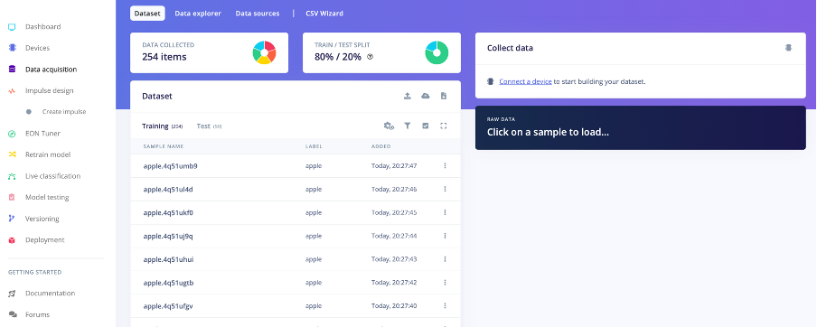
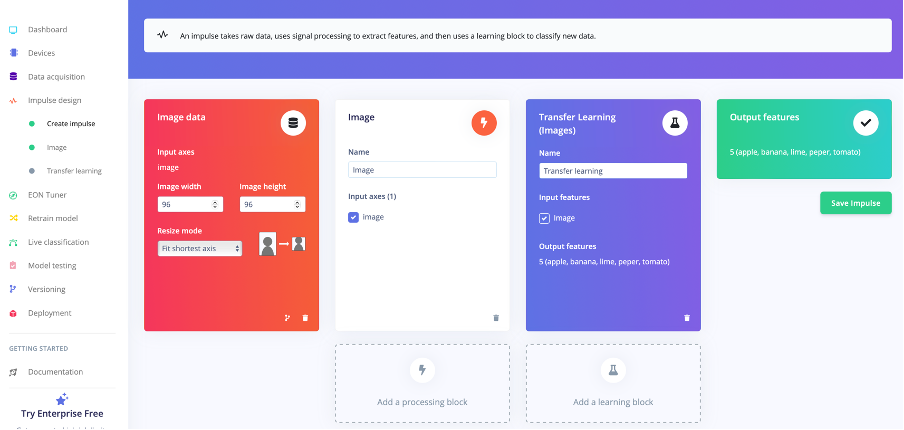
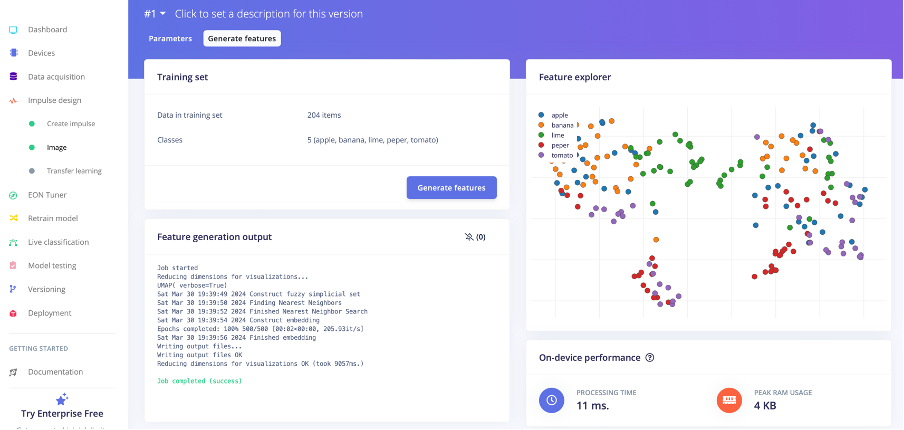
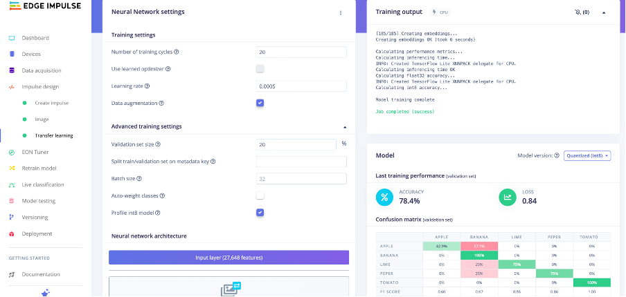
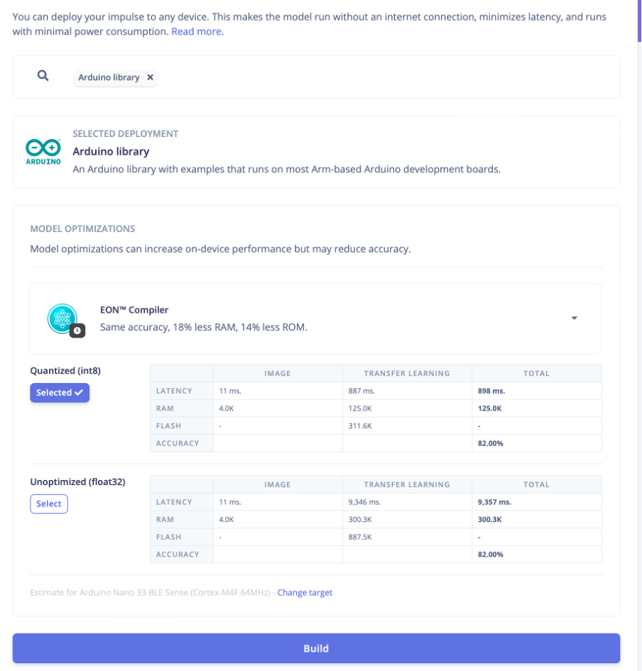

# Fruit classification on microcontrollers

Today, you will go through the entire process of collecting data, training a model and deploying it on microcontrollers.
For this exercise we will use [Edge Impulse](https://edgeimpulse.com) tools, which makes these steps easier to do.
We will further be running models on the [Arduino Tiny Machine Learning Kit](https://store.arduino.cc/products/arduino-tiny-machine-learning-kit).

1. Go to the Edge Impulse website and sign up,
2. Log in to the Studio and create a project,
3. Make sure that in the _Project info_ section of the project dashboard the _Labeling method_ field is set to _One laebl per data item_ (image classification rather than object detection).

## Data collection

We have provided a couple pieces of fruits for each of you. We will now build an image dataset.

1. Go to the _Data acquisition_ tab,
2. Press the _connect device_ button,
3. Scan the QR code using your phone,
4. Change the label at the top of the screen to reflect the name of the fruit,
5. Take pictures of the fruit from multiple angles (50-100 photos per fruit),
6. See the pictures being streamed to studio,
7. Repeat for all the fruit types.

The pictures in each class should be automatically split into training and test (80-20 split).

You can use the data explorer to see the separation of data using a pretrained model.

Reflect on the way you collect the data. How could this affect the results in production. Think about diversity.

## Designing the impulse

After you have collected the data, we need to design the data pipeline for processing them.

1. Navigate to the _Impulse design_ tab and _Create Impulse_,
2. Leave the default settings in the _Image data section_. This sets the final image size used as the input to the model after cropping and rescaling.
3. Press the _Add a processing block_ button and select the _Image_ option. This will take care of the necessary preprocessing stages of the pipeline.
4. Press the _Add a learning block_ button and select the _Transfer Learning (Images)_ option. This means we will use a pretrained model during training and build upon that. This option requires significantly lower number of images during the training.
5. Press the _Save Impulse_ button.

## Build features

We have designed main building blocks of the pipeline. We will now use the preprocessing block to generate features for training.

1. Navigate to the _Impulse design_ tab and _Image_,
2. Leave the default options,
3. Press the _Save parameters_ button,
4. Press the _Generate features_ button,
5. You can now see how separable the data is using just the features, instead of the pretrained model embeddings used in the _Data acquisition_ step.

## Training

Once we have processed the data we can design the training.

1. Navigate to the _Impulse design_ tab and _Transfer learning_,
2. Leave the default options,
3. Press the _Start training_ button.

Inspect the RAM and FLASH usage. How does this compare to the resources we have available on our device? Check its documentation.

You can change the model to change the utilization.

Once the model fits on the device, check the accuracy of the model before and after quantization. Compare the accuracy achieved on training and the validation datasets.

You can change the following parameters:

- Number of training cycles (epochs) - in case the accuracy kept on increasing at the end of the training, it might require more epochs to arrive at the highest achieveable accuracy
- Learning rate - in case we are overfitting (training accuracy significantly higher than validation), we can decrease the learning rate slightly
- Data augmentation - increases the robustness of the model by randomly transforming the images during training.
- Neurons in final layer - increase the size to increase the capacity of the model. It increases the memory requirements significantly.
- Dropout - increase the dropout parameter slightly in order to increase the robustness of the model. This will also help with retaining accuracy after the quantization step.

## Deployment

After you are happy with the performance of your model, you can deploy it on the Arduino kit.

1. Navigate to the _Deployment_ tab,
2. Test the models on test data to get their accuracy before and after quantization
3. Change the _Selected deployment_ to _Arduino library_
4. Press the _Build_ button
5. Open the Arduino IDE
6. Navigate to _Sketch > Include library > Add .ZIP library_
7. Select the ZIP file downloaded from the Edge Impulse
8. In the _Boards manager_ install the _Arduino Mbed OS Nano Boards_
9. In the _Library manager_ install the _Arduino_OV767X_ library
10. Connect the board to your computer and select it as the target.
11. Navigate to _File > Examples > [Name of the downloaded library] > nano_ble33_sense > nano_ble33_sense_camera_
12. Build and Upload the sketch (takes longer than usual)
13. You should see the output in the serial monitor.

You can now point the camera at the fruit to test the performance of the model in real life. The device will take an image every two seconds and output the probability of each class.

You can now compare the results with other group. Compare the performance of you models under edge cases. Include hands, change backgrounds or even add other fruit at the edge of the images.
