# Smile/non-Smile (binary) Classifier with Edge Impulse

**Goal**: Training a simple neural network for classifying smile/ non-smile images.

Download the dataset's .zip file from [this link](smileDS.7z) and unzip it.

Create an account on the [Edge Impulse](https://www.edgeimpulse.com/), then follow the following steps:

## Step 1: Setting up the project
After activating you account, the make a new project, name it and specify the specifications for it like as the following figures show:

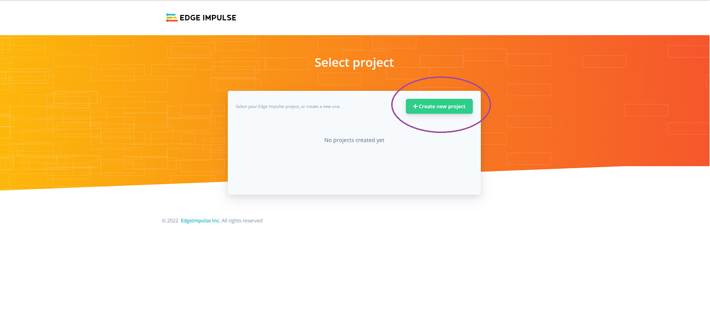

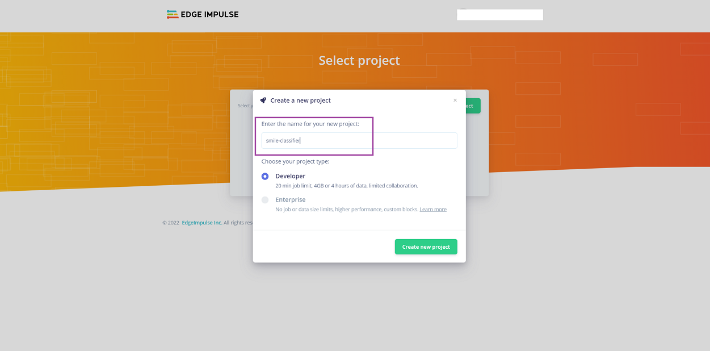

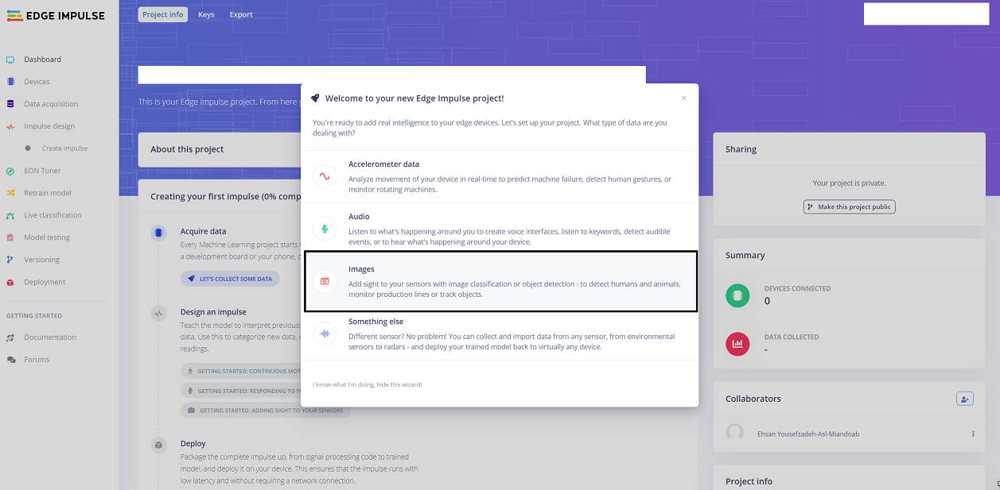

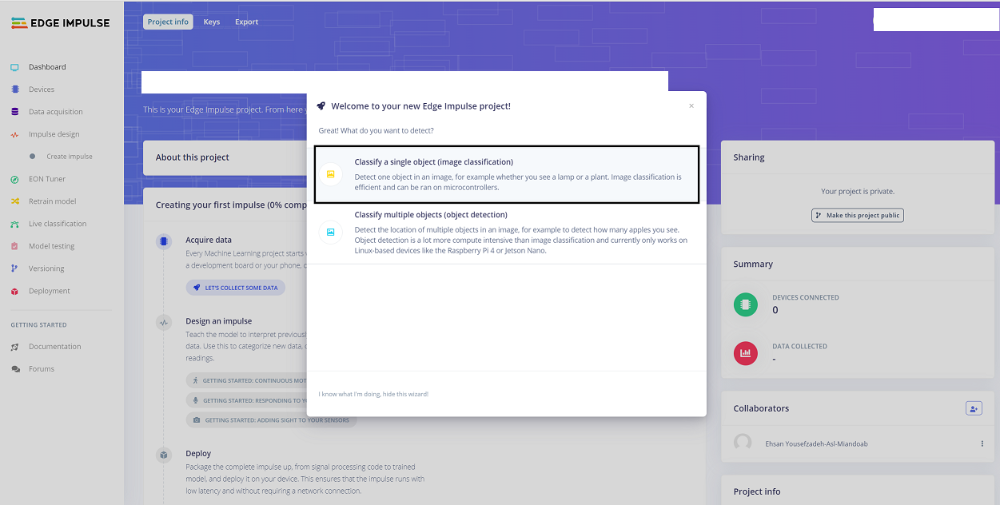

## Step 2: Uploading Dataset
In this step, you will use the downloaded dataset and upload it to the project as the following figures show:

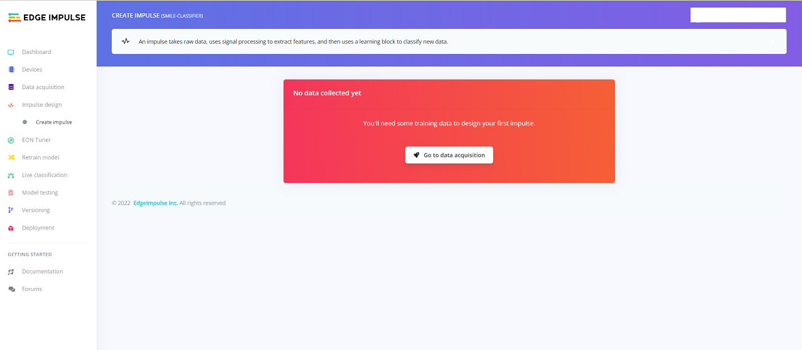

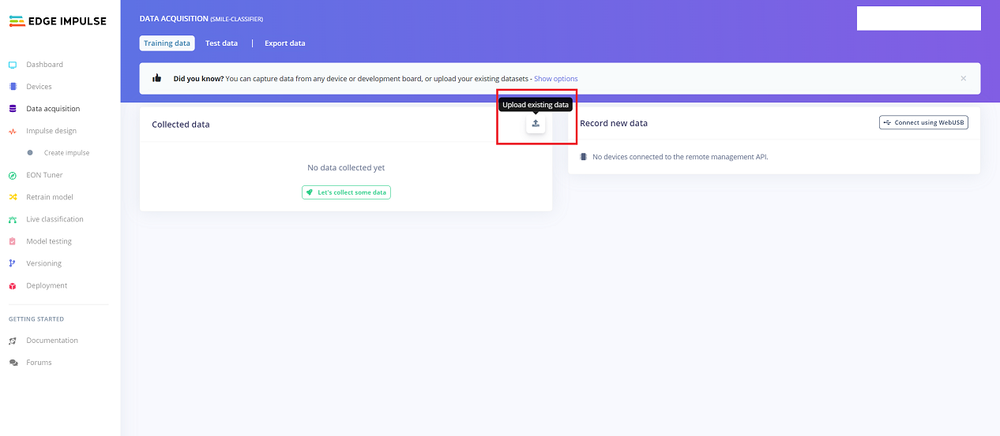

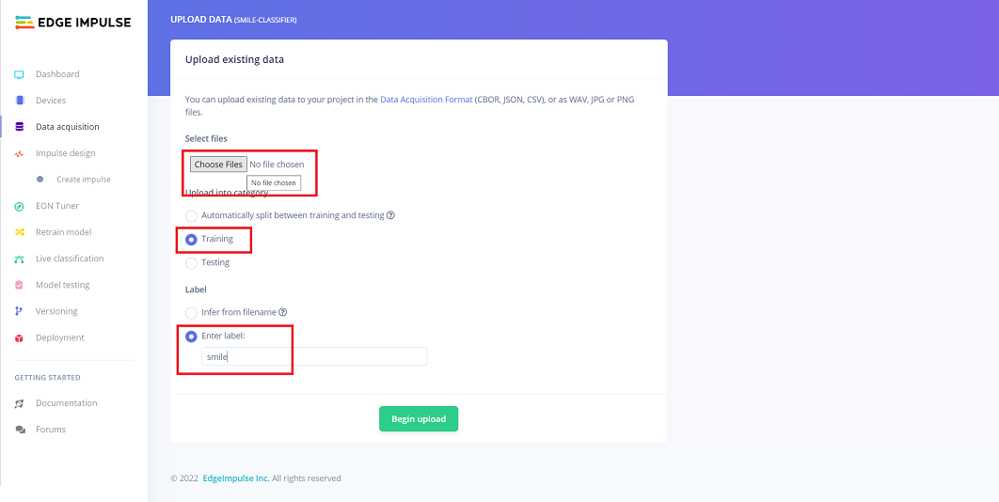

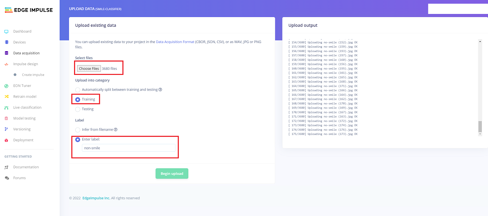

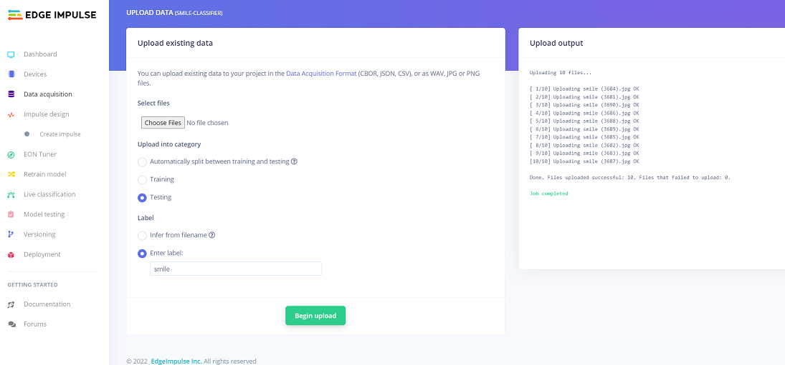

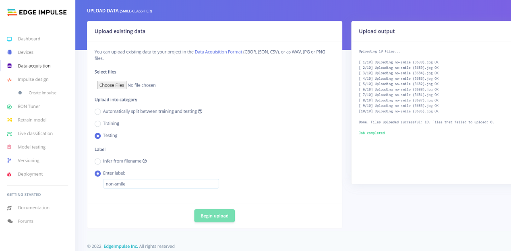

## Step 3: Configuring the Model

In this step, go to the "**Impulse Design**" tab on the left side of the screen. Go into "**Create Impulse**". For processing block select image, and for learning block add Keras Classification as shown in the following figures. Then save it.

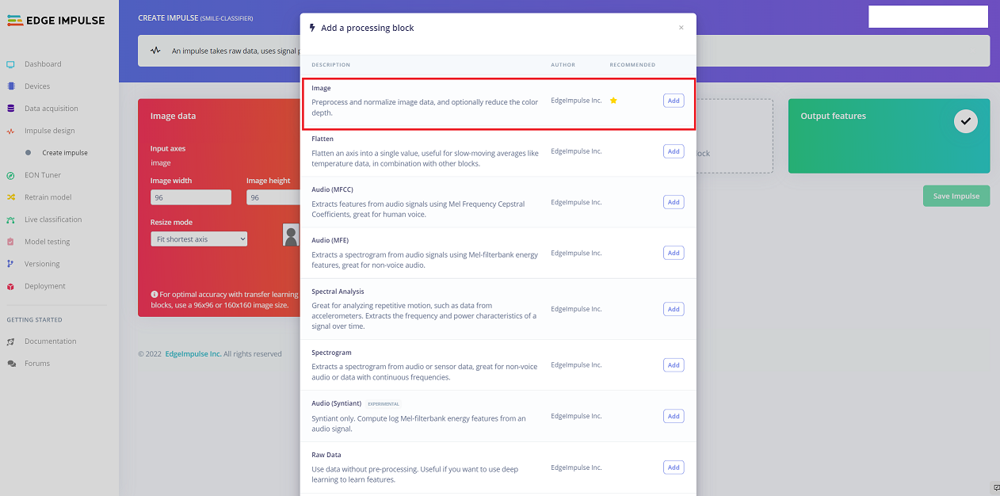

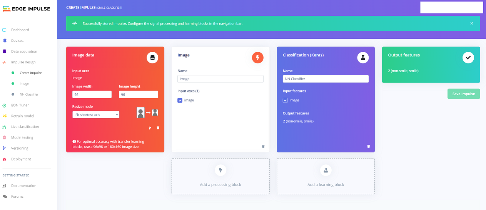

Then, go to the Image under the Create Impule, and change color depth to grayscale and save it. Then, "Generate features", it will take some minute, so be patient :D.

Then, go to the NN classifier, press the "Start Training". It will train the model with the uploaded data. If you look at the model, it has two convolutional layers, with a flattern layer and droping out with 0.25 rate. You can change the learning rate, and validation set size or number of epochs you want to train the model. Test with some different numbers and see each one's effect on the model's accuracy and training execution time. Also, you can look at [this](https://playground.tensorflow.org/#activation=tanh&batchSize=10&dataset=circle&regDataset=reg-plane&learningRate=0.03&regularizationRate=0&noise=0&networkShape=4,2&seed=0.92473&showTestData=false&discretize=false&percTrainData=50&x=true&y=true&xTimesY=false&xSquared=false&ySquared=false&cosX=false&sinX=false&cosY=false&sinY=false&collectStats=false&problem=classification&initZero=false&hideText=false) to get more idea what it going on.

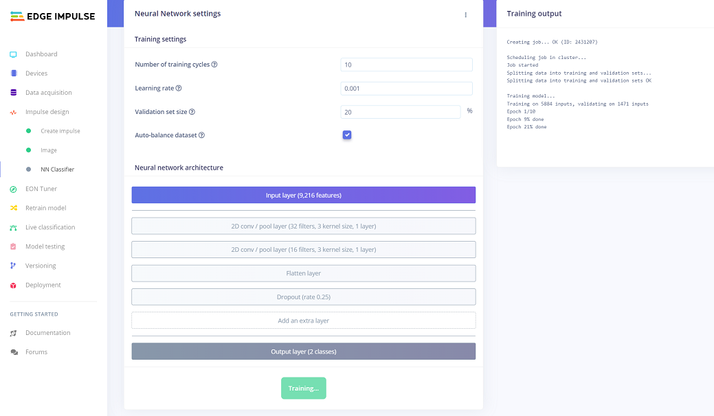

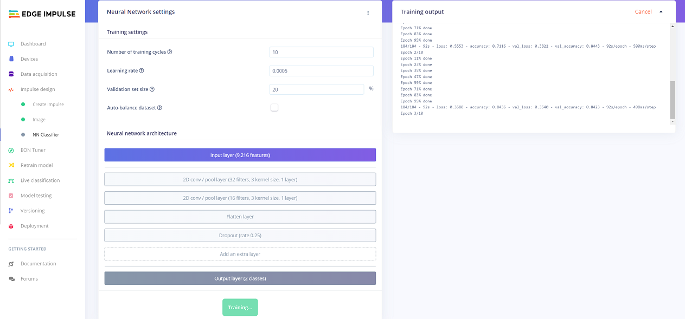

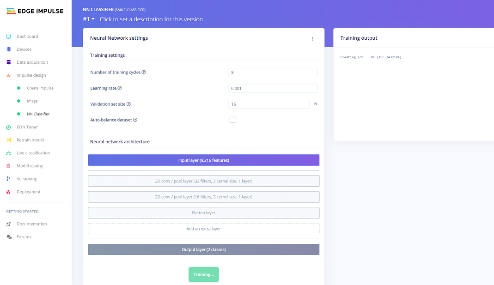

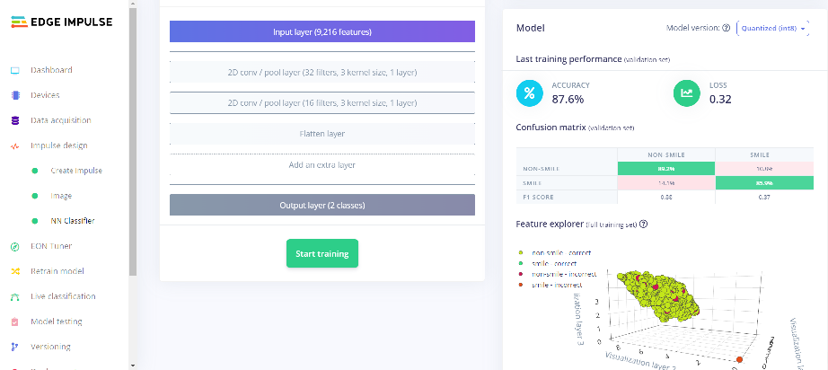

## Step 4: Deploy on your phone
Go to the Deployment tab on the left side of the screen, scroll down and select Mobile Phone. Then, scan and enjoy your model. Take pictures from your teammate or nearby person (first get permission :D) and test how it is working.

## Points worthy of mention
1. The balance of data for each class is crucial for having a healthy model, otherwise it won't be able to accomplish its task well. Do an experiment on this by giving the 1/10 or less smile images to the image and look how the model peforms. Can you imagine the intuition about what is happening in this case?

2. We have a model for smile/ no-smile classifier for grayscale images, so when we are testing with it, we have to give it grayscale images. Color images have three channels that our model won't be able to get it!

3. TensorFlow, [TensorFlow Lite](https://www.tensorflow.org/lite)
The "Edge Impulse" uses TensorFlow Lite for providing more memory and computational conservative model for running on edge device. It accomplish this task by decreasing the precision. It changes Floating-Point data/ operations to integer data/ operations.

Also, PyTorch has Mobile Edition ([Check Here](https://pytorch.org/mobile/home/)).