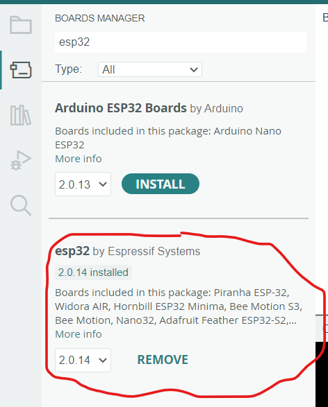
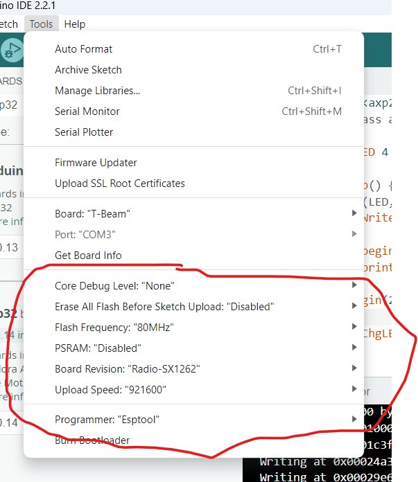
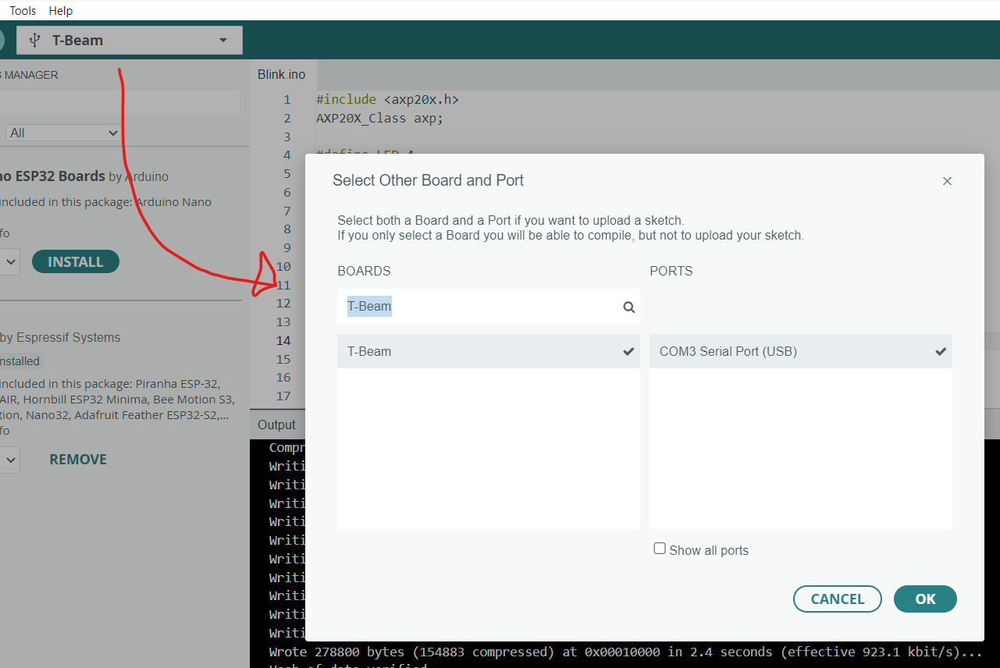
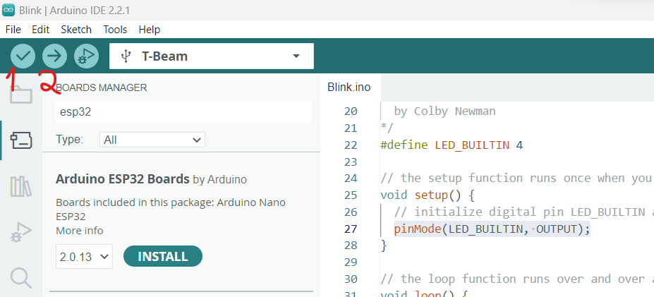

# LilyGo TBeam v1.1 - Hello World Guide

*NOTE:* This program is written for C/C++, using .ino-files, commonly used in Arduino

This tutorial/exercise will set up a simple program on our LilyGo TBeam V1.1. In order to do so, there are a few **prerequisites**:

- The Arduino IDE 
- Micro-USB cable
- A LilyGo TBeam v1.1 board ;)


## Setting up the physical board

1. As a general rule, if a board has a radio and an antenna connector, always connect the antenna before powering up. Unterminated antenna connectors might lead to reflected signal, and damage the radio.
   (Not likely to happen here, but it is good to follow that rule always.)
2. Connect the board to your computer via the USB Micro cable.
3. As long as we are powered over USB, we do not need a battery. But you may put one in anyway.


## Setting up Arduino IDE

1. Download the relevant IDE for your system here: https://www.arduino.cc/en/software
2. Clone this [repository](https://github.com/Xinyuan-LilyGO/LilyGo-LoRa-Series), and copy the *contents* of the **lib** folder.
3. Paste the contents to your Arduino Libraries Directory. You usually find this folder here:
    - For MacOS: ~/Documents/Arduino/libraries
    - For Linux: ~/Arduino/libraries
    - For Windows: Documents/Arduino/libraries
4. Now, we need to **setup the board manager**: 
    - Navigate to the board manager (Tools --> Board --> Board Manager)
    - Search for esp32, and choose the one that looks like this: 
        
        
    - Now we can choose T-Beam as our board. Go to (Tools --> Board --> esp32 --> T-Beam) to select our board. It is a long list, so it may be hard to find.
    - I recommend that your settings look somewhat like this (exact looks may vary depending on OS and Arduino version):
        
        
5. After configuring our board tools, the final step is to ensure we have selected the correct port. It should look somewhat like this:
    

## Developing & uploading your first blink program

*NOTE:* This program is very much inspired by: https://github.com/LilyGO/TTGO-T7-Demo/blob/master/blink/blink.ino 

Now, we are ready to develop and upload our first blink program!

When developing a program for an embedded device, they usually follow a structure like this:

    # Some imports & definitions of global variables

    void setup() {
        # Your setup code here
    }

    void loop() {
        # Your looping code here
    }

These programs, which you write in .ino-files in the Arduino IDE, have this structure to allow for an initial setup and a loop that will continue to run as long as the device is not turned off/set to sleep.
How do we use this when developing?
In order to develop our blink program, we need to first figure out how to turn on and off the red LED on your board. For me, the LED is set to be pin 4 (this might not be the case for you; if so, I recommend looking into the documentation or reaching out to me). Using this information, we can then define a variable that makes it easier to remember the LED's pin and set it to be output.

    #define LED 4

    void setup() {
        pinMode(LED, OUTPUT);
    }

    void loop() {
        # Your looping code here
    }

Now, we only need to set up the loop that allows for our LED to blink. We do this in the loop method, using *digitalWrite* and *delay*. We use *digitalWrite* to set the voltage to high (to turn the light on) and low (to turn the light off). We use delay to set a small break (in this example, 1 sec):

    #define LED 4

    void setup() {
        pinMode(LED, OUTPUT);
    }

    void loop() {
        digitalWrite(LED, HIGH);
        delay(1000); //delays are in ms
        digitalWrite(LED, LOW); 
        delay(1000);           
    }

Now we are ready to verify & upload! 
If you have followed the guide, you should be able to verify the program and also upload your simple blink program:



You use (1) to verify your program and (2) to upload your program to your board.
The IDE will (hopefully) open the output window, where you can see your program getting uploaded. There might be some trouble with connection and getting your program to start on the board.
You likely need to turn on the board or restart it.
Try to hit these buttons on your board for approx. 6 seconds, or reach out, and I will help to troubleshoot.

Hopefully, you will have a blinking board when you reach this part!

To verify that it is really your code controlling the device, try changing the delay times and see if it reacts as expected.

Also, we add another standard control mechnaism here: we write something to the serial output, which we can read from the Arduino IDE.
You will see this a lot in later exercises.

    #define LED 4

    void setup() {
        pinMode(LED, OUTPUT);
        Serial.begin(9600);
    }

    void loop() {
        digitalWrite(LED, HIGH);
        Serial.println("On");
        delay(5000); 
        digitalWrite(LED, LOW); 
        Serial.println("Off");
        delay(5000);           
    }

Another test you could do now is 
to put in a battery, disconnect and reset your board -
it should be blinking just like before!

## FreeRTOS on the TTGO

We said, embedded systems are single task. Well, not quite ...

To run multiple tasks on the 2 cores of the ESP32 we can leverage FreeRTOS. 
In the next example, we create 2 tasks each pinned to its own core. One blinks the LED, the other one prints debug messages.
   ```
#define LED 4

TaskHandle_t Task1;
TaskHandle_t Task2;

void blinkLed( void * parameter ) {
  while(1) {
    digitalWrite(LED, HIGH);
    delay(1000); 
    digitalWrite(LED, LOW); 
    delay(1000);     
  }
}

void printStuff( void * parameter ) {
  while(1) {
    Serial.print("Blink on core ");
    Serial.println(xPortGetCoreID());
    delay(3000);
  }
}

void setup() {
    pinMode(LED, OUTPUT);
    Serial.begin(9600);

    xTaskCreatePinnedToCore(blinkLed,"Task1",10000,NULL,1,&Task1,0); 
    xTaskCreatePinnedToCore(printStuff,"Task2",10000,NULL,1,&Task2,1); 
}

void loop() {
          
}
```

## References/Inspiration/Sources
- https://github.com/Xinyuan-LilyGO/LilyGo-LoRa-Series
- https://github.com/luckynrslevin/TTGO-T-Beam-Blinking
- https://github.com/espressif/arduino-esp32/issues/8191
- https://github.com/LilyGO/TTGO-T7-Demo/blob/master/blink/blink.ino 
